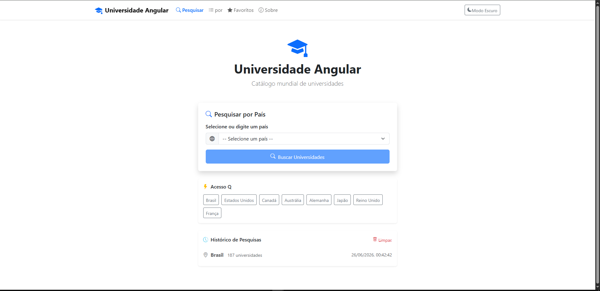
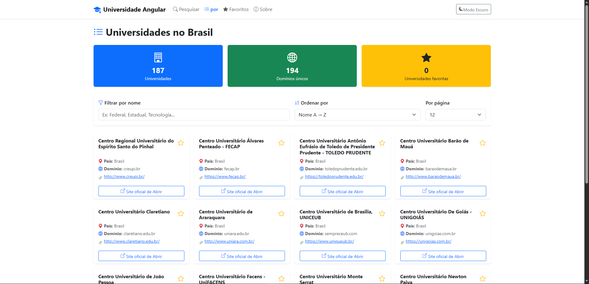
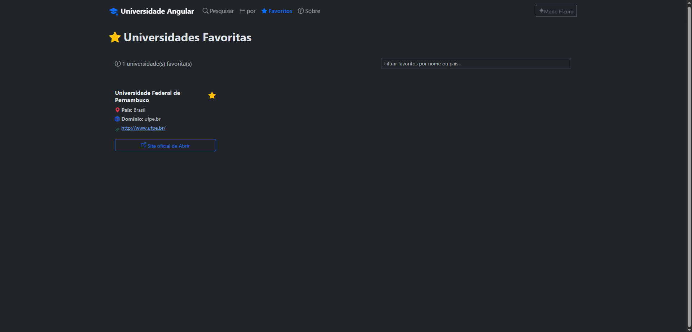
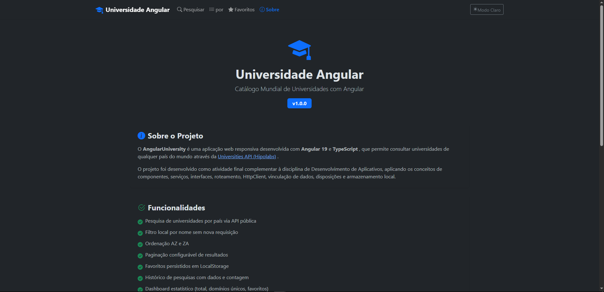

# 🎓 Angular University

> Catálogo mundial de Universidades com Angular

## 🚀 Demo ao Vivo

> **O aplicativo está hospedado no Netlify:**
> ### 👉 [https://angularuniversity.netlify.app](https://angularuniversity.netlify.app)
>
> *(O GitHub Pages não suporta a API utilizada neste projeto pois ela opera apenas em HTTP, enquanto o GitHub Pages exige HTTPS. O Netlify resolve isso com um proxy server-side.)*

---

[](https://angular.io/)
[](https://www.typescriptlang.org/)
[](https://getbootstrap.com/)
[](https://www.chartjs.org/)
[](LICENSE)

---

## 📋 Objetivo do Projeto

O **Angular University** é uma aplicação web responsiva desenvolvida com **Angular 19** e **TypeScript** que permite consultar e exibir informações sobre universidades de qualquer país do mundo, consumindo a [Universities API (Hipolabs)](http://universities.hipolabs.com).

O projeto aplica os principais conceitos de desenvolvimento Angular:
- Componentes standalone, Serviços, Interfaces TypeScript
- Roteamento com lazy loading
- HttpClient para consumo de API REST
- Data Binding (interpolação, property, event e two-way)
- Diretivas (`*ngFor`, `*ngIf`)
- Armazenamento local com LocalStorage

---

## 🖥️ Telas do Sistema

### Tela Inicial — Pesquisa por País


*Seleção de país com acesso rápido e histórico de pesquisas recentes*

### Tela de Resultados — Listagem de Universidades


*Dashboard estatístico, filtro local, ordenação, paginação e gráfico de barras com Chart.js*

### Tela de Favoritos


*Universidades marcadas como favoritas, persistidas em LocalStorage*

### Tela Sobre


*Informações sobre o projeto, tecnologias utilizadas e desenvolvedor*

---

## 🚀 Tecnologias Utilizadas

| Tecnologia | Versão | Finalidade |
|---|---|---|
| [Angular](https://angular.io/) | 19.x | Framework principal |
| [TypeScript](https://www.typescriptlang.org/) | 5.x | Linguagem de programação |
| [Bootstrap](https://getbootstrap.com/) | 5.x | Estilização responsiva |
| [Bootstrap Icons](https://icons.getbootstrap.com/) | 1.x | Ícones |
| [Chart.js](https://www.chartjs.org/) | 4.x | Gráficos estatísticos |
| [Universities API](http://universities.hipolabs.com) | — | API REST pública de universidades |

---

## ⚙️ Instruções de Instalação

### Pré-requisitos

- [Node.js](https://nodejs.org/) v18 ou superior
- [npm](https://www.npmjs.com/) v9 ou superior
- [Angular CLI](https://cli.angular.io/) v19 ou superior

### Passo a passo

```bash
# 1. Clone o repositório
git clone https://github.com/SEU_USUARIO/AngularUniversity.git

# 2. Entre na pasta do projeto
cd AngularUniversity

# 3. Instale as dependências
npm install

# 4. Inicie o servidor de desenvolvimento
ng serve

# 5. Acesse no navegador
# http://localhost:4200
```

### Build de produção

```bash
ng build
# Os arquivos serão gerados em dist/AngularUniversity/
```

---

## 🗂️ Estrutura do Sistema

```
AngularUniversity/
├── src/
│   ├── app/
│   │   ├── components/              # Componentes reutilizáveis
│   │   │   ├── navbar/              # Barra de navegação + toggle dark mode
│   │   │   ├── university-card/     # Card de universidade com favorito
│   │   │   └── dashboard/           # Dashboard estatístico
│   │   ├── interfaces/              # Tipos TypeScript
│   │   │   ├── university.interface.ts
│   │   │   └── search-history.interface.ts
│   │   ├── pages/                   # Páginas da aplicação
│   │   │   ├── home/                # Pesquisa por país + histórico
│   │   │   ├── results/             # Lista + filtro + sort + paginação + chart
│   │   │   ├── favorites/           # Universidades favoritas
│   │   │   └── about/               # Sobre o projeto e desenvolvedor
│   │   ├── services/                # Serviços (lógica de negócio)
│   │   │   ├── university.service.ts  # Consumo da API REST
│   │   │   ├── favorites.service.ts   # Gerenciamento de favoritos
│   │   │   ├── history.service.ts     # Histórico de pesquisas
│   │   │   └── theme.service.ts       # Dark/Light mode
│   │   ├── app.ts                   # Componente raiz
│   │   ├── app.config.ts            # Configuração da aplicação
│   │   └── app.routes.ts            # Definição de rotas
│   ├── styles.scss                  # Estilos globais
│   └── index.html                   # HTML principal
├── .gitignore
├── LICENSE
├── README.md
├── angular.json
├── package.json
└── tsconfig.json
```

---

## ✅ Funcionalidades Implementadas

### Obrigatórias
- [x] **Pesquisa por país** — seletor com mais de 70 países e acesso rápido
- [x] **Listagem de universidades** — nome, país, domínio e website
- [x] **Abertura do site oficial** — nova aba ao clicar
- [x] **Filtro local** — filtragem por nome sem nova chamada à API
- [x] **Histórico de pesquisas** — data, país e contagem em LocalStorage
- [x] **Favoritos** — marcação e persistência em LocalStorage
- [x] **Dashboard estatístico** — total, domínios únicos, favoritas
- [x] **Ordenação** — Nome A→Z e Z→A
- [x] **Interface responsiva** — desktop, tablet e smartphone

### Bônus (+15%)
- [x] **Paginação** — 6, 12, 24 ou 50 resultados por página
- [x] **Dark Mode / Light Mode** — toggle com persistência em LocalStorage
- [x] **Gráfico Chart.js** — barras com quantidade de universidades por país pesquisado

---

## 📡 API Utilizada

**Universities API — Hipolabs**

```
GET http://universities.hipolabs.com/search?country={country}
```

- Gratuita, sem autenticação, sem token, sem cadastro
- Retorna JSON

Exemplo de retorno:
```json
[
  {
    "name": "Universidade de São Paulo",
    "country": "Brazil",
    "alpha_two_code": "BR",
    "domains": ["usp.br"],
    "web_pages": ["http://www.usp.br/"],
    "state-province": null
  }
]
```

---

## 📄 Licença

Este projeto está licenciado sob a [Licença MIT](LICENSE).

---

## 👨‍💻 Desenvolvedor

**Matheus Amancio**
Estudante de Desenvolvimento de Software
📧 matheusamancio006@gmail.com
